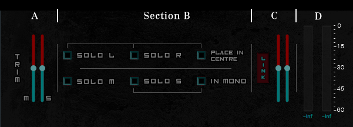

# **DeCoder VST Documentation (V1.0.0)**

***

## **A Brief Description**

DeCoder is an open source audio plugin / Standalone application that, as its name implies, decodes a stereo audio signal into Mid-Side channel format, letting the user listen to each channel in isolation, as well as adjust their volume. At its core, it manipulates a stereo signal so using it on mono tracks (in case your DAW allows so) may lead to abnormalities.

***

## **Processing chain and Usage Demonstration**

One can divide plugin’s processing chain into 4 sections

### **Section A**

In Section A there are 2 *trim sliders* that apply gain to the Mid and Side channels respectively.

You can completely mute each channel by dragging the *slider* on the lower end of its range, or apply a +6dB gain by dragging the *slider* on the top end. Mid position refers to a value of 0dB gain.

### **Section B**

In Section B there are some *buttons* that let you isolate a specific channel of the stereo data stream.

* **Solo L:** Isolate the Left channel
* **Solo R:** Isolate the Right channel
* **Place in Centre:** If either “Solo L“ or “Solo R” is selected, enabling this will      place the selected channel in the centre
* **Solo M:** Isolate the Mid channel
* **Solo S:** Isolate the Side Channel
* **In Mono:** If “Solo S” is selected, enabling this will collapse the Side channel in Mono.

Note that choosing to isolate any of the Left, Right, Mid or Side channels will bypass Section A. This happens because Section A is dedicated to rebalancing Mid/Side signal ratio in a Stereo data stream; choosing any of the modes in Section B would make Section A just an extra gain staging step.

### **Section C**

In Section C there are 2 output trim Sliders and a link button.

Sliders can apply any gain from -inf dB to +6dB to the Left and Right channels respectively, with the mid position referring to a gain value of 0dB. Pressing the link button will **slave** the right *slider* to the left one, mirroring it’s movement (not its position). If any of the plugin’s output (L or R) channels peaks, the respective *slider* will turn red. Clicking on them restores their original colours.

Note that these sliders apply gain to the output of the previous sections (Section A if none of the solo modes is selected or Section B if any of the solo modes is enabled.)

### **Section D**

In Section D there are two Meters displaying Peak and RMS values of the plugin’s output in dBFS. The ballistics of the meters are fixed in a way that makes them easily monitored.
The two values displayed under these two meters refer to the maximum peak value of the plugin’s output. Clicking on them will reset the values.

Note that RMS calculations are not based on any of the loudness metering algorithms (EBU, weighted etc.) It is calculated just as the RMS of the last 2048 samples just to give some loudness information to the user.

 ***

## **Extras**
This distribution comes with VST3 and AU plugin formats, as well as a Standalone app. Having access to the AAX SDK (used to make aax plugins) is difficult since Avid supports only certified developers.