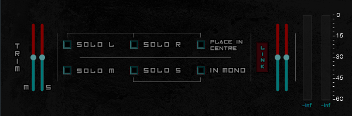

# **DeCoder Audio Plugin**


***

## **Description**

**DeCoder** is an open source audio plugin / Standalone application written in C++ and based on [JUCE](https://juce.com) 
framework. It is a simple tool that, as its name implies, decodes a stereo audio signal into Mid-Side channel format, 
letting the user listen to each channel in isolation, as well as adjust their volume.

It is the first of a series of audio plugins and tools that are going to be released.

It is also my first actual experience regarding audio coding and software engineering in general, so any feedback would be highly appreciated!

***




## **Target platforms and formats**

**DeCoder** comes in the following formats:

* VST3
* AU
* Standalone (currently tested and built only for MacOS)


---

## **Download**

You can get **DeCoder** either by downloading its source code and building it directly on your machine, or by just downloading the pre-compiled binaries.


## Building from source

The project is configured using _CMake_ and _Juce's CMake API_ , so in order to build it you need to have a C++ compiler 
and [CMake](https://cmake.org/install/) installed. According to [Juce's CMake API Documentation](https://github.com/juce-framework/JUCE/blob/master/docs/CMake%20API.md), 
plugin projects like **DeCoder** require CMake 3.15 or above.

### Build Steps

1. Clone the repo and navigate to it:

    ```
    git clone https://github.com/GiorgosKoulouris/DeCoderPlugin.git

    cd path/to/repo
    ```

2. Since JUCE library in already in the repo, you are all set to proceed to generating the project

    ```
    # If you want a specific generator:
    cmake -G 'Your Generator' -B ./build

    # If you want your system's default generator
    cmake -B ./build
   ```

3. Build the project
   
   ```
   cmake --build build (--target DeCoder) (--config Release/Debug/...)
   
   # Or if you use Makefiles you can instead use
   cd build
   make
   ```
   
   If you generated the project using an IDE as a generator you can navigate to build folder and open the generated project
   located there.
   
### Note
   
   When building **DeCoder** using *makefiles*, predefining CMAKE_BUILD_TYPE and using *make* command was the only solution to build *Release* config while reducing binary's size and avoiding having corrupted files generated.
   
   For example, in my system that has makefiles as its default generator:
   
   ```
   # Instead of:
   cmake -B ./build
   cmake --build build --target DeCoder --config Release

   # Command chain would be:
   cmake -B ./build -DCMAKE_BUILD_TYPE=Release
   cd build/
   make
   ```

   Maybe that's an issue happening exclusively on my machine (MacOS 10.12), or i am just missing something from the *cmake* and/or *make* procedures. In any case, if anyone gets his hand on the project I would be grateful if I had his feedback on the issue.
   
## Downloading pre-compiled binaries

Download links for the pre-compiled and ready-for-use binaries. Note that, at the moment, builds have been made only for MacOS systems. Building and testing on Windows will take place soon. Please read the *System Requirements* section below.

* MacOS
   
   * [Installer](https://drive.google.com/file/d/1GwGzY9Up-s0Cn8pq4U_FOoBZ5vL2EMYe/view?usp=sharing)
   * [Binaries](https://drive.google.com/file/d/1tGJkPGgIMmLBxfxxehVlwkyPLyQ3TUPI/view?usp=sharing)
* Unfortunately, Windows users have to be a bit more patient if they choose not to build **DeCoder** from source.

***

## **System Requirements**

At the moment, **DeCoder** has been tested in a very limited number of systems, so I am not able to give specific information about this issue. To anyone that forks and builds the project in a Windows environment, or in any MacOS > 10.12, please consider sending some feedback back about it. I am going to update my system and cross-check different environments soon, but any info would be valuable.

***

## **Contributing**

Since **DeCoder** is my first dive into the waters of audio coding (and coding in general), I would be grateful if anyone that spots any errors or mulfunctions, or has any feature/add-on/improvement proposals contributed by either just visiting the discussion section or by creating a pull request.

***

## **License**

**DeCoder** is released under the [GNU General Public License v.3](https://www.gnu.org/licenses/gpl-3.0.en.html). For more information about GPLv.3, read the [COPYING](COPYING) file

                       
***

